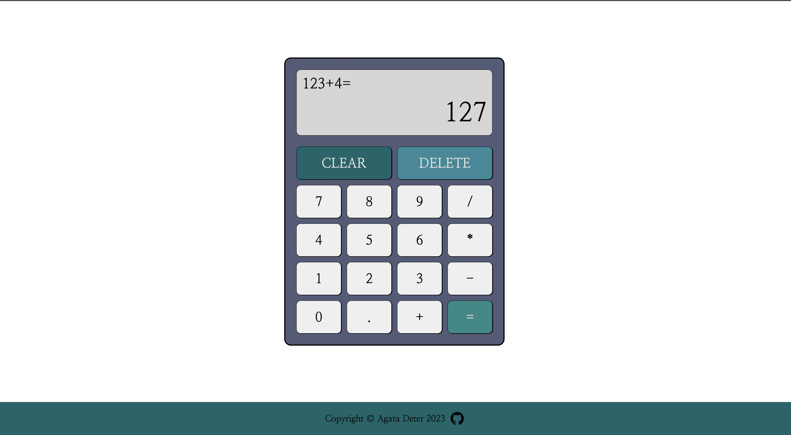

# Calculator

## Table of Contents
* [General Info](#general-information)
* [Technologies](#technologies)
* [Screenshots](#screenshots)
* [Link to game](#link-to-game)
* [Setup](#setup)
* [Usage](#usage)

## General information
Project is one of the task from [The Odin Project](https://www.theodinproject.com/lessons/foundations-calculator). It is a continuation of learning JavaScript.

## Technologies
* CSS3
* HTML5
* JavaScript

## Screenshots

## Link to game
https://agata10.github.io/calculator/

## Setup

1. Fork repository 
or
2. Clone reposiory
   `git clone https://github.com/YOUR-USERNAME/YOUR-REPOSITORY`

## Usage

This project has 4 mathematical operations:

1. add
2. subtract
3. multiply
4. divide

What is more, user can clear the output or delete unwanted or wrong digits. 
Calculator has a display for input and for current math operation. 
User also can insert decimal numbers. 
When dividing by zero, there will show up an alert. 

